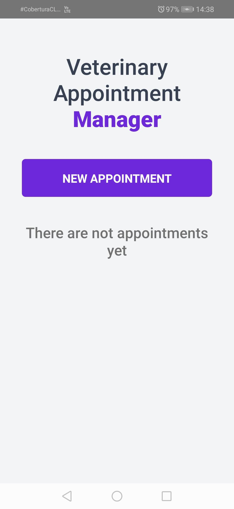
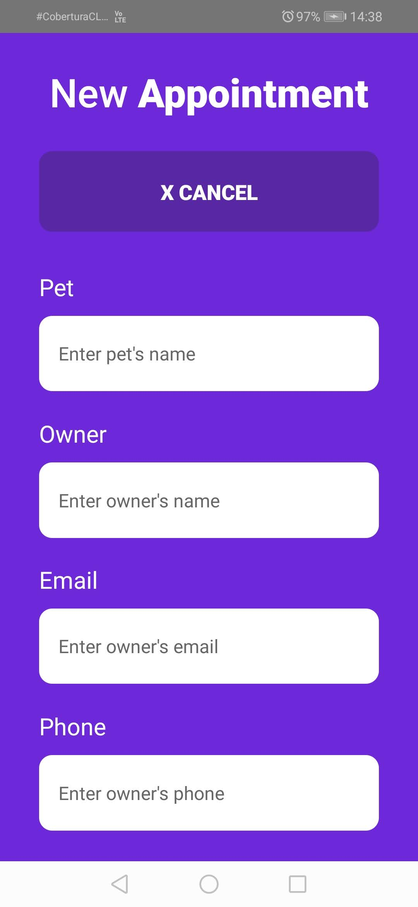
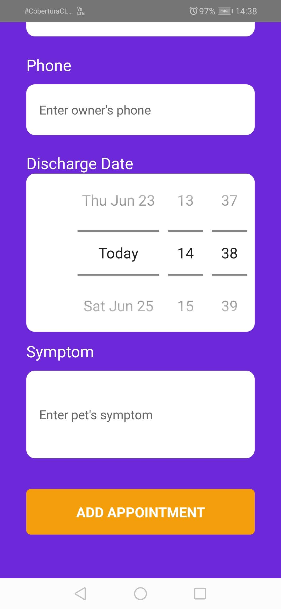
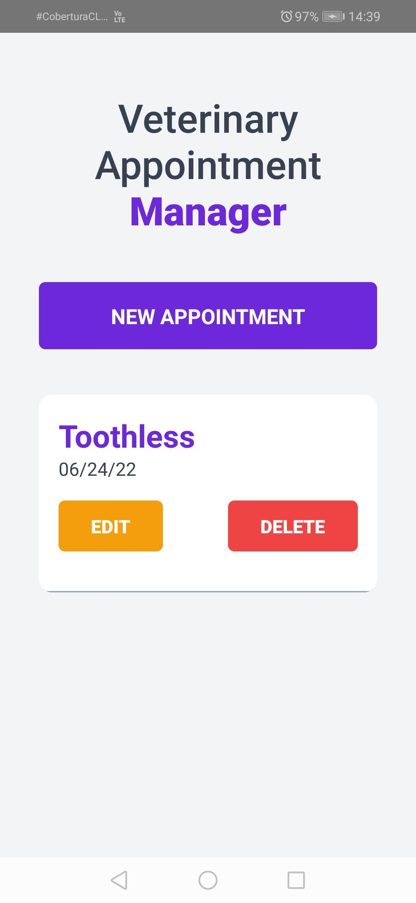
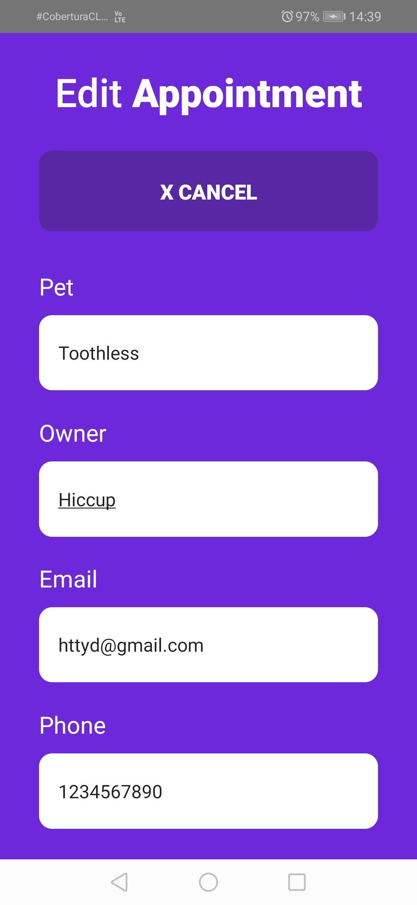
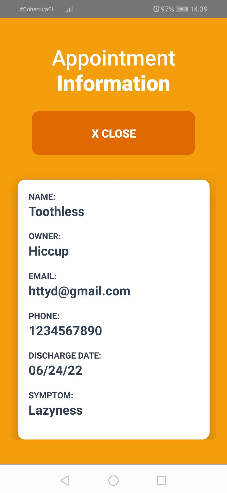
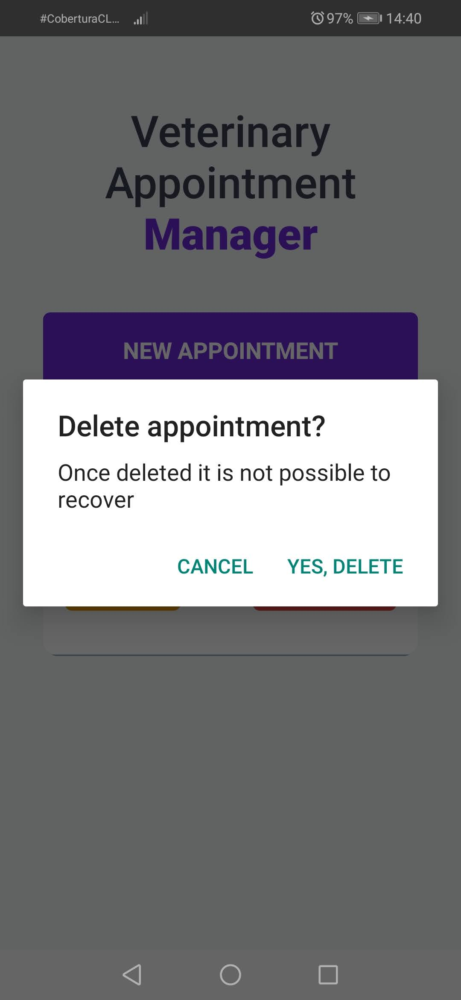

# Veterinary_Appointments-RN

This application was created as a first approach to React Native technology, tested in the Android version.

### Functionality

- Create, edit and delete appointments to the veterinary
- Show the data from the selected patient in a modal
- Async Storage to keep the data even when the app is closed

## Installation

To install this project follow the next steps:

1.  Download the repository found here: [GitHub Repository](https://github.com/SuaferoanTJK/Veterinary_Appointments-RN)
2.  Run **npm install** script
3.  Run **npx react-native run-android** script to raise the development server.
4.  Watch the emergent emulator on your pc or your android cellphone (if the device is connected to the pc via USB and has developer mode enable).

## Screenshots

  
  
  
  
  
  
  

## Get in touch

### LinkedIn

https://www.linkedin.com/in/andrés-f-suárez/
